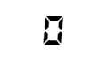

## 什么是E-DataV?

* E-DataV是一个基于**Vue2**的数据可视化组件库（后续会增加[Vue3版本]及[React版本]）
* 提供数据可视化大屏所需的各种组件，朋友写的[DataV](https://github.com/DataV-Team/DataV)组件库中已有的组件，我这边不会过多增加，最多是效果提升
* 因工作原因及个人比较佛系，更新会比较慢，但会持续更新，后续计划先增加Vue3和React版本，然后同步更新三个版本中的可视化组件

### npm安装

```shell
$ npm install e-datav
```

### 使用

```js
import Vue from 'vue'
import EDataV from 'e-datav'

Vue.use(EDataV)

// 按需引入
import { DigitalFlop } from 'e-datav'
Vue.use(DigitalFlop)
```

### UMD版

```js

<body>
    <div id="app">
        <e-digital-flop :value="999"></e-digital-flop>
    </div>
</body>
<script src="https://cdn.jsdelivr.net/npm/vue/dist/vue.js"></script>
<script src="https://unpkg.com/e-datav/dist/e-datav.min.vue.js"></script>
<script>
    new Vue({
        el: '#app'
    })
</script>

```

### 组件介绍

#### 数字翻牌器

```js

// main.js
import { DigitalFlop } from 'e-datav'
Vue.use(DigitalFlop)

// App.vue
<template>
  <div id="app">
    <e-digital-flop :value="value" :decimals="2" />
  </div>
</template>

<script>
export default {
  name: 'App',
  data() {
    return {
      value: 999
    }
  }
}
</script>
```
##### 效果演示



##### 可选参数
字段|类型|备注
-|-|-
value|Number|数值，默认1000
decimals|Number|小数点，默认0
duration|Number|持续时间，默认3000毫秒
fontSize|Number|字体大小，默认50
fontFamily|String|字体，默认液晶字体，传空值则恢复正常浏览器字体
color|String|颜色，默认#000


#### 全屏组件

根据屏幕尺寸，自动拉伸

```js

// main.js
import { FullScreenContainer } from 'e-datav'
Vue.use(FullScreenContainer)

// App.vue
<template>
  <div id="app">
    <e-full-screen-container>
      <e-digital-flop :value="value" :decimals="2" />
    </e-full-screen-container>
  </div>
</template>

```

##### 可选参数
字段|类型|备注
-|-|-
type|String|数值，默认'full', 其他可选类型：full（全屏拉伸） full-width（宽度拉伸 ）full-height（高度拉伸）initial （默认不拉伸）
width|Number|大屏设计稿宽度，也就是公司设计师出的效果图尺寸，默认1920
height|Number|大屏设计稿高度，默认1080