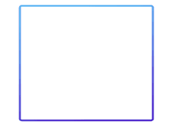

## E-DataV
<a href="https://www.npmjs.com/package/e-datav">
    
</a>

### 什么是E-DataV?

* E-DataV是一个基于**Vue2**的数据可视化组件库（[Vue2版本](https://github.com/costaq/E-DataV)及[React版本](https://github.com/costaq/E-DataV-React)）
* 提供数据可视化大屏所需的各种组件，朋友写的[DataV](https://github.com/DataV-Team/DataV)组件库中已有的组件，我这边不会过多增加，最多是效果提升
* 因个人比较佛系，更新会比较慢，但会持续更新

### npm安装

```shell
$ npm install e-datav
```

### 使用

```js
import Vue from 'vue'
import EDataV from 'e-datav'

Vue.use(EDataV)

// 按需引入
import { EDigitalFlop } from 'e-datav'
Vue.use(EDigitalFlop)
```

### UMD版

```js

<body>
    <div id="app">
        <e-digital-flop :value="9999" separator=","></e-digital-flop>
    </div>
</body>
<script src="https://cdn.jsdelivr.net/npm/vue/dist/vue.js"></script>
<script src="https://unpkg.com/e-datav/dist/e-datav.min.vue.js"></script>
<script>
    new Vue({
        el: '#app'
    })
</script>

```

### 组件介绍

#### 数字翻牌器

```js

// main.js
import { EDigitalFlop } from 'e-datav'
Vue.use(EDigitalFlop)

// App.vue
<template>
  <div id="app">
    <e-digital-flop :value="value" :decimals="2" separator="," />
  </div>
</template>

<script>
export default {
  name: 'App',
  data() {
    return {
      value: 9999
    }
  }
}
</script>
```
##### 效果演示


##### 可选参数
字段|类型|备注
-|-|-
value|Number|数值，默认1000
decimals|Number|小数点，默认0
duration|Number|持续时间，默认3000毫秒
fontSize|Number|字体大小，默认50
fontFamily|String|字体，默认液晶字体，传空值则恢复正常浏览器字体
color|String|颜色，默认#000
separator|String|千位分隔符，默认''


---

#### 水位图

```js

// main.js
import { EWaterLevelPond } from 'e-datav'
Vue.use(EWaterLevelPond)

// App.vue
<template>
  <div id="app">
    <!-- 若不通过样式设置宽高，则根据父元素100%拉伸 -->
    <e-water-level-pond style="width:200px;height:200px;" :value="56" :background-color="'#000'" />
  </div>
</template>

```
##### 效果演示


##### 可选参数
字段|类型|备注
-|-|-
value|Number|数值，必填项，必须传递0~100之间的值
decimals|Number|小数点，默认0
duration|Number|数字变动时动画持续时间，默认3000毫秒
fontSize|Number|字体大小，默认36
fontColor|String|颜色，默认#000
backgroundColor|String|背景色颜色，默认transparent透明
waveColors|String[]|水波颜色，默认['#41a9e3', '#b0e0ff']，第一个参数为前波浪，后一个参数为后波浪

---

#### Tab组件

```js

// main.js
import { ETab } from 'e-datav'
Vue.use(ETab)

// App.vue
<template>
  <div id="app">
    <!-- 若不通过样式设置宽高，则根据父元素100%拉伸 -->
    <e-tab style="width:500px;height:100px;" :items="items" :columns="3" @change="handleChange"></e-tab>
  </div>
</template>
<script>
export default {
  name: 'App',
  data() {
    return {
      items: [{label: 'test1', value: '1'}, {label: 'test2', value: '2'}],
    }
  },
  methods: {
    handleChange(value) {
      console.log(value);
    }
  }
}
</script>
</script>
```

##### 效果演示

竖列效果


横列效果


##### 可选参数
字段|类型|备注
-|-|-
value|Number或String|非必填，必须是数字或字符串，指定当前值，若不指定，则会默认选中items中的第一个
items|TabItem[]|项，必填
columns|Number|列数，非必填，默认值3，表示显示3列，单竖列效果即传值1即可
margin|Number|间距，非必填，默认每项间距10px
fontSize|Number|文本字号，非必填，默认16
fontColor|Number|文本颜色，非必填，默认#fff
backgroundColor|Number|背景色，非必填，默认transparent
duration|Number|动画持续时间，非必填，默认值3，表示3秒
borderColors|Number|边框渐变颜色，非必填，默认值['#1CE3B6', '#1F38F1', '#F95A5A']

###### TabItem
字段|类型|备注
-|-|-
label|String|显示名
value|Number或String|值，必须是数字或字符串

###### 事件
事件名称|说明|回调参数
-|-|-
change|值变化时触发的事件|选中的item值

---

#### 全屏组件

根据屏幕尺寸，自动拉伸

```js

// main.js
import { EFullScreenContainer } from 'e-datav'
Vue.use(EFullScreenContainer)

// App.vue
<template>
  <div id="app">
    <e-full-screen-container>
      <e-digital-flop :value="value" :decimals="2" />
    </e-full-screen-container>
  </div>
</template>

```

##### 可选参数
字段|类型|备注
-|-|-
type|String|数值，默认'full', 其他可选类型：full（全屏拉伸） full-width（宽度拉伸 ）full-height（高度拉伸）initial （默认不拉伸）
width|Number|大屏设计稿宽度，也就是公司设计师出的效果图尺寸，默认1920
height|Number|大屏设计稿高度，默认1080

---

#### 边框组件

边框组件1

```js

// main.js
import { EBorderBox1 } from 'e-datav'
Vue.use(EBorderBox1)

// App.vue
<template>
    <div>
        <!-- 若不通过样式设置宽高，则根据父元素100%拉伸 -->
        <e-border-box-1 style="width:200px;height:200px;">
        </e-border-box-1>
    </div>
</template>

```

##### 效果演示



##### 可选参数
字段|类型|备注
-|-|-
borderRadius|Number|边框圆角，默认值3
borderWidth|Number|边框宽度，默认值3
colors|String[]|渐变颜色，默认值['#5ddcff', '#4e00c2']，只接受2个值
duration|Number|动画持续时间，默认值4，单位秒

---

边框组件1

```js

// main.js
import { EBorderBox2 } from 'e-datav'
Vue.use(EBorderBox2)

// App.vue
<template>
    <div>
        <!-- 若不通过样式设置宽高，则根据父元素100%拉伸 -->
        <e-border-box-2 style="width:200px;height:200px;">
        </e-border-box-2>
    </div>
</template>

```

##### 效果演示


##### 可选参数
字段|类型|备注
-|-|-
borderColor|String|边框颜色，默认值#4cc7f3
borderWidth|Number|边框宽度，默认值2
lineWidth|Number|边框线长度，默认值10
backgroundColor|String|背景色，默认值rgba(76, 199, 243, 0.15)
